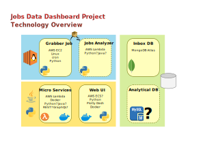

# Jobs Data Dashboard Project

My personal project to create a system with various technologies, just for knowledge.
A jobs data system to grab data from several sources, compile them and shows it in a dashboard.

This repository have only the project documentation.
The documentation was produced using Libre Office.

Some documents about the project:
* [Logging](doc/Logging.md)
* [Grabber Job](doc/GrabberJob.md)

## Project Structure

Each component of the project will have a separate repository, with everything that the component needs to compile.
The documentation will have its own repository.

**List of repositories:**

- [JobsDataDashboard](https://github.com/itamarc/JobsDataDashboard)
  - *General documentation of the project (this repository).*

- [JobsDataDashboard-jddgrabber](https://github.com/itamarc/JobsDataDashboard-jddgrabber)
  - *Component made in Python to grab the data from the jobs online services.*
    - conf
    - src
    - test
    - requirements.txt

- [JobsDataDashboard-jddlogfunc](https://github.com/itamarc/JobsDataDashboard-jddlogfunc)
  - *Component made in Java to get the log messages out of a SQS queue and insert it into a Collection in MongoDB.*
    *It runs as an AWS Lambda function.*
    - src/main/java
    - src/test/java
    - pom.xml

- JobsDataDashboard-jddwebui
  - *Component with the web user interface.*

## Tools adopted

Here I will list the tools I'm using for each task in the project.
This list will be updated each time I change a tool.

* For development in Python (version 3.9)
  - Visual Studio Code
  - libraries listed in `requirements.txt`

* For development in Java 11
  - Visual Studio Code
  - Maven
    - dependencies listed in `pom.xml`

* For code versioning
  - GitHub and GitHub Desktop
  - Integration and unit tests with pytest/JUnit triggered by GH Actions

* Cloud services - AWS
  - Linux server with a cron job to grab data
  - Serverless webservices (Lambda functions)
  - MongoDB Atlas
  - *(TBD: web interface)*

* For documentation:

  - Libre Office
  - Inkscape SVG

